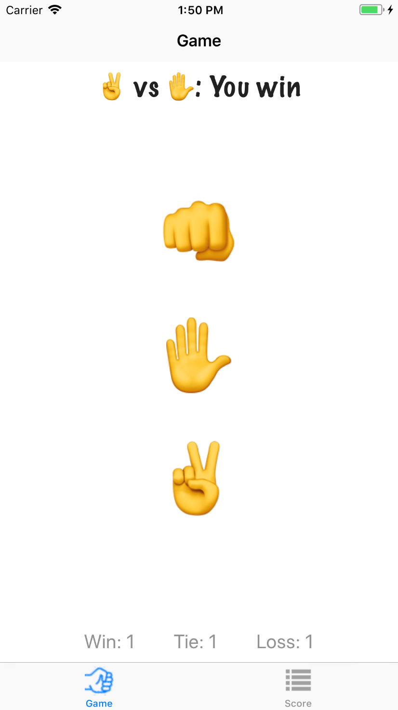

# Rock-Paper-Scissors-with-History
The rock paper scissors game that uses navigation controllers, tab bar controllers, auto layout, and a table view to see the score rankings of previous games.

## Screen shots

 

## Requirements

### MVC
- [x] Write a model class RPSGame that is used for the RPS game functionality and the match results

### Auto Layout

- [x] Use a vertical stack view for the three buttons for rock, paper, and scissors.  

- [x] Using Auto Layout, center the stack view both horizontally and vertically in the Safe Area of the view. 

- [x] Add a new label to the Game tab.  Using Auto Layout, it should be 10 points above the bottom of the Safe Area, and should be centered horizontally.  It should display a running total of wins, losses and ties.
